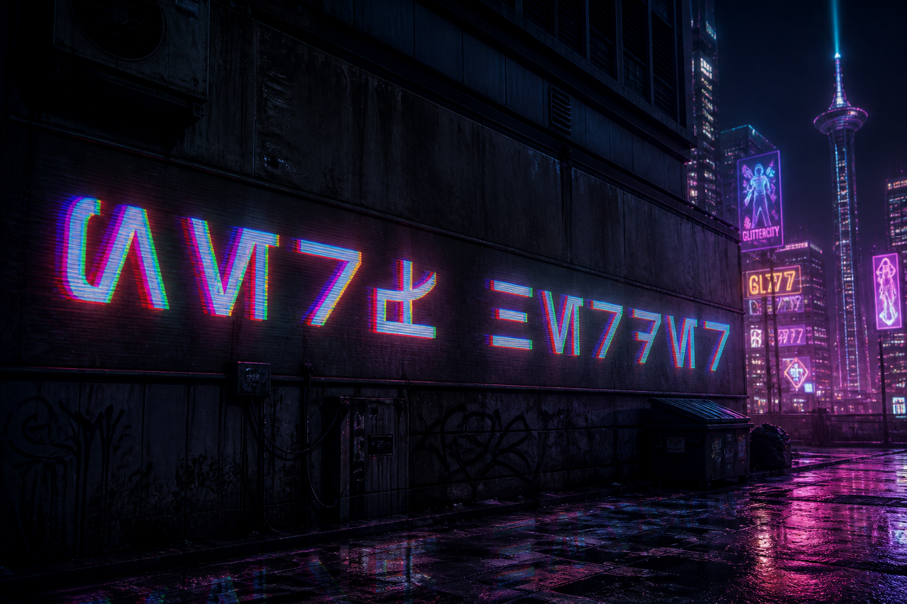
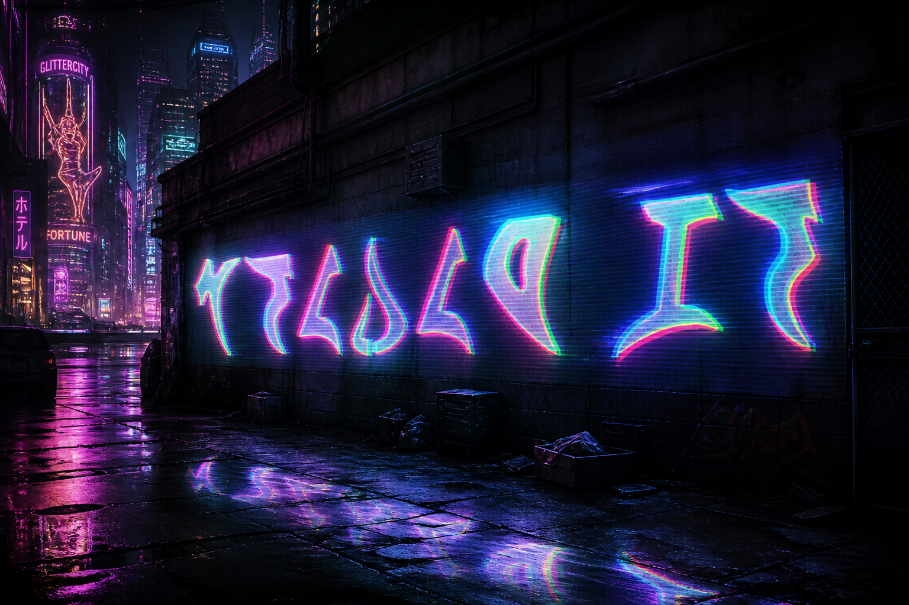
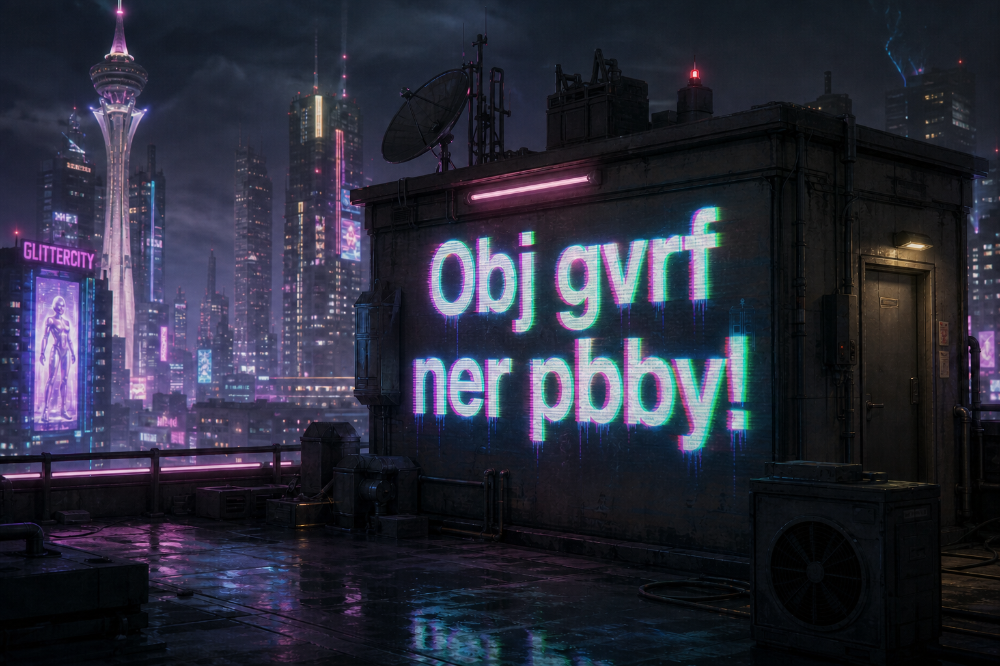
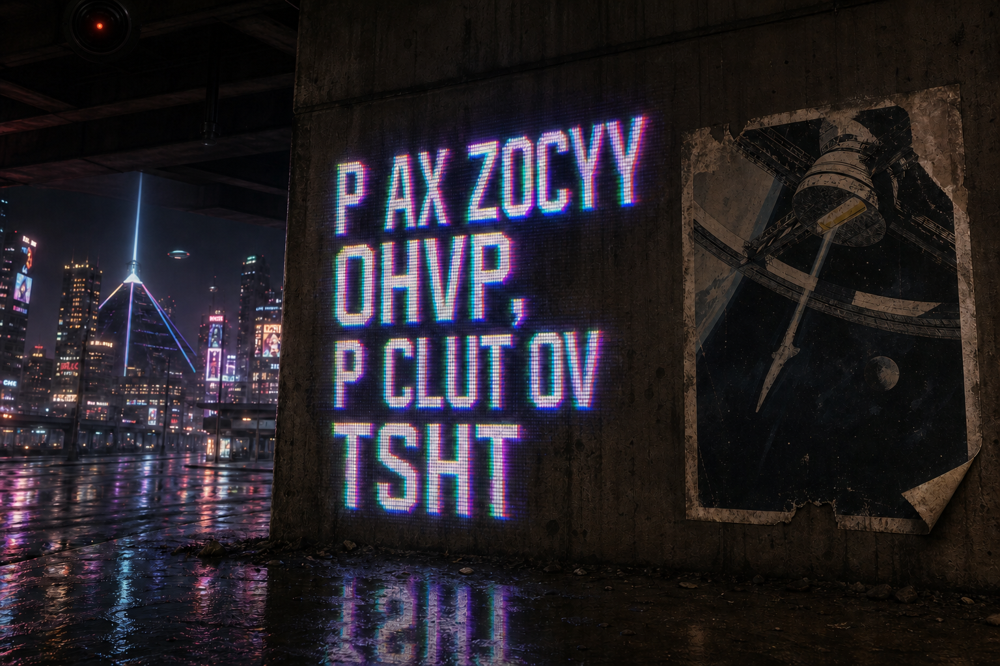
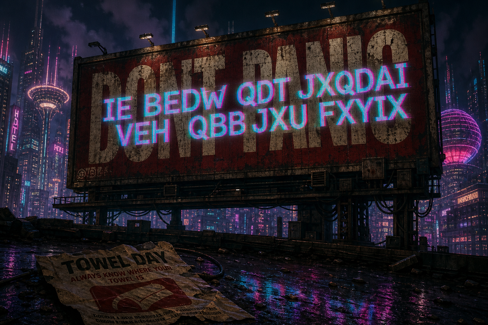

### Misc

#### Strange Holos 1 — Star Wars

**Cipher/Language:** Aurebesh  
**Decoded text:** `NERF HARDER`  
**Theme:** Star Wars

---

#### Strange Holos 2 — Star Trek

**Cipher/Language:** Klingon  
**Decoded text:** `BOLDLY GO`  
**Theme:** Star Trek

---

#### Strange Holos 3 — Doctor Who

**Cipher:** ROT13  
**Decoded text:** `BOW TIES ARE COOL!`  
**Theme:** Doctor Who

---

#### Strange Holos 4 — 2001: A Space Odyssey

**Cipher:** Vigenère cipher  
**Key:** `HAL`  
**Decoded text:** `I AM SORRY DAVE, I CANT DO THAT`  
**Theme:** 2001: A Space Odyssey

---

#### Strange Holos 5 — The Hitchhiker's Guide to the Galaxy

**Cipher:** ROT10  
**Decoded text:** `SO LONG AND THANKS FOR ALL THE PHISH`  
**Theme:** The Hitchhiker's Guide to the Galaxy

---
### Cipher References

For identifying and decoding the ciphers, the following tools were useful:

- **Symbol ciphers:** [dCode — Symbol Ciphers](https://www.dcode.fr/symbols-ciphers)
- **General-purpose decoder:** [CyberChef](https://cyberchef.org/)
    

These were used to identify/decode the various cipher formats found in the challenges.

